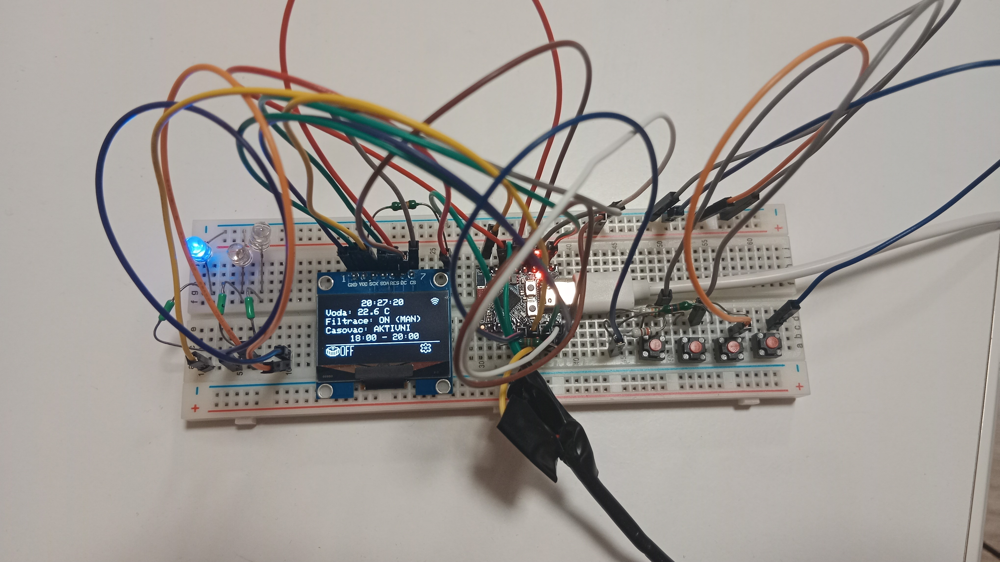
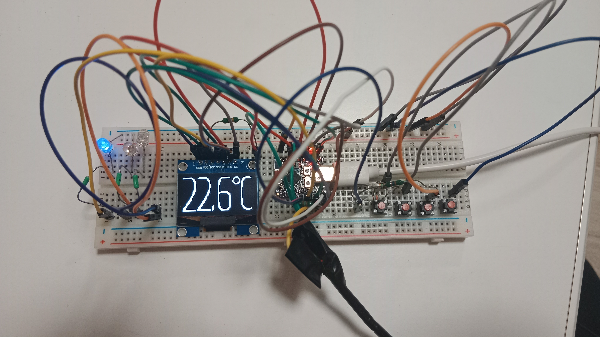
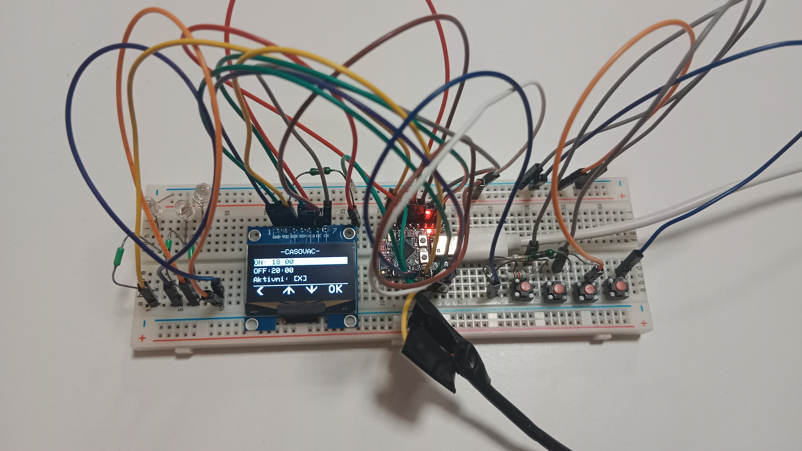

## **pool-filtration-esp-controller-with-lcd**

#### **\# 🚧 Work in Progress**

Pool filtration controller with OLED 128x64 display, with 4 softkey control.
You can setup pool filtration timer through the menu with softkeys, and also on webserver.
Long press settings softkey will get you to system settings menu and network information.

After 15s  (you can change this time in system settings menu) of inactivity, OLED will show big font water temperature.

More photos in images folder.
